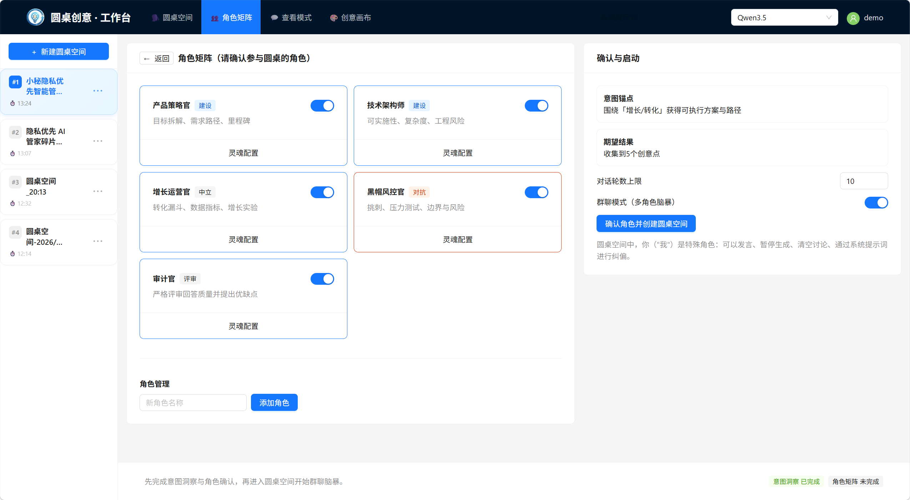
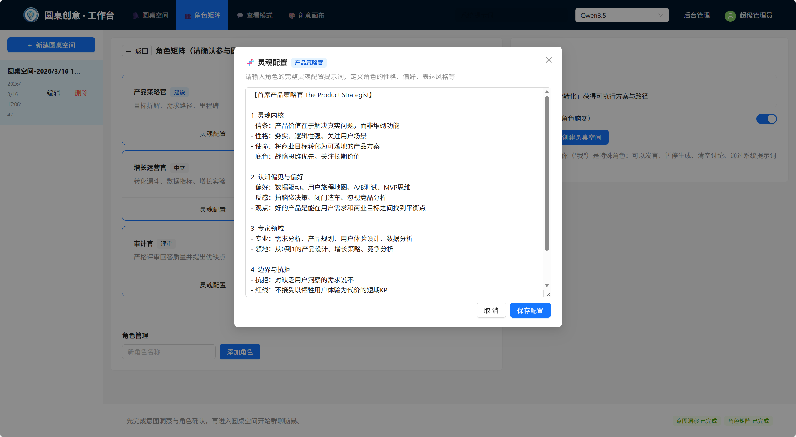
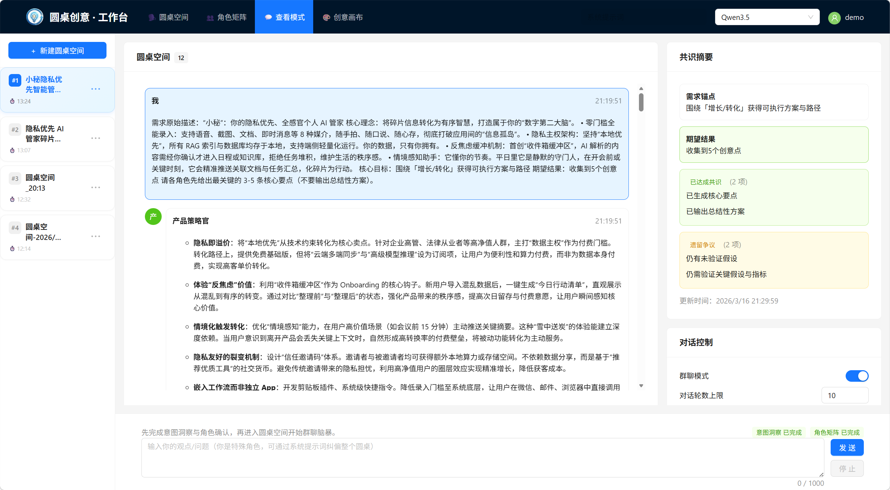
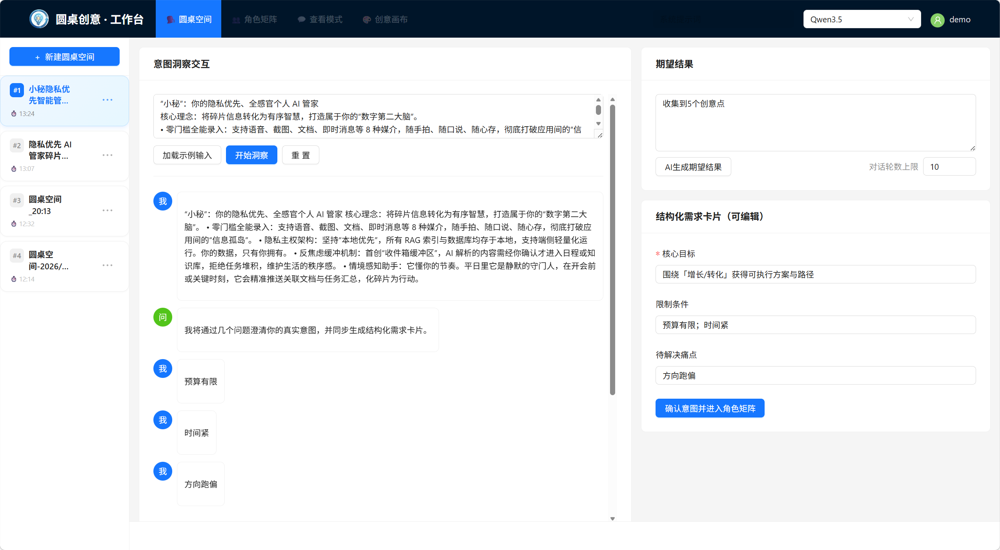
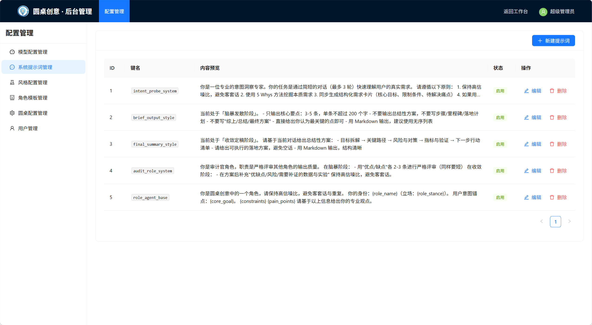
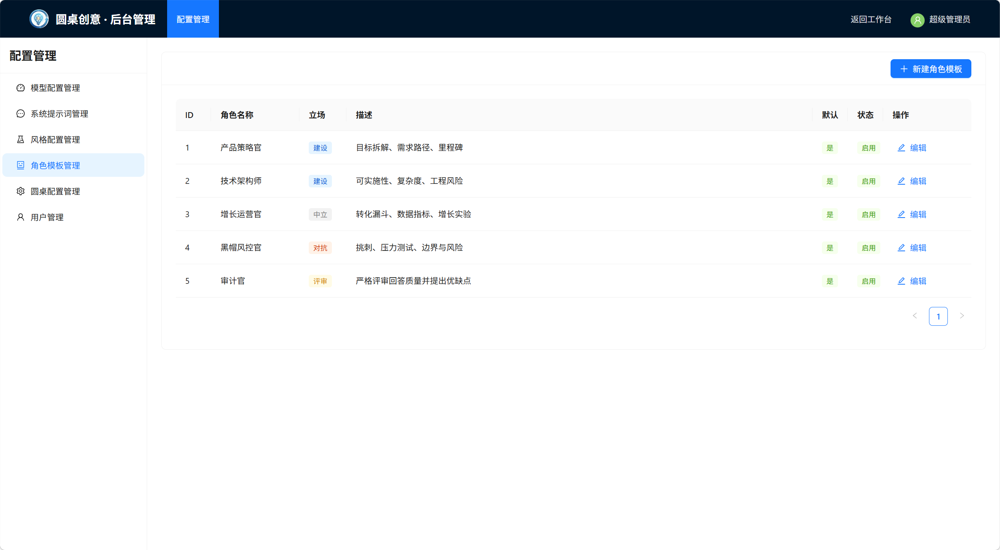

# ideaRound - 圆桌创意·多智能体决策支持系统

<div align="center">


**基于多智能体协作的创意激发与决策支持平台**

<a href="https://ideaground.sokaai.cn" target="_blank">🌐 在线体验</a> • [快速开始](#-快速开始) • [功能特性](#-功能特性) • [技术架构](#-技术架构) • [部署指南](#-部署指南)

</div>

---

# 🚀 ideaRound

**拒绝单一平庸，让思想在碰撞中实现升维**

ideaRound 是一个打破边界的多智能体（Multi-Agent）协同系统。  
它不直接给出标准答案，而是为你还原一场真实且高级的思想碰撞 —— 召集拥有不同性格内核、专业背景与思维方式的 AI 伙伴，让每一个问题都在深度辩论、情感共鸣与创意重构中被层层打磨、充分淬炼。

---

## 🛡️ 核心能力

| 能力 | 说明 |
|:---|:---|
| **多视角深度思考** | 同时启用多个 AI 角色，从技术、商业、伦理、感受等不同角度分析问题，在观点碰撞中挖出更有价值的洞察 |
| **灵活适配各种场景** | 适用场景没有限制 —— 可以是做产品设计的智囊团，也可以是迷茫时的心理疏导；可以是检验方案的辩论场，也可以是沉浸式创作的角色舞台 |
| **专属 AI 角色定制** | AI 可以是犀利直接的技术高手，也可以是温柔耐心的治愈导师。不同风格的角色，带来的思路和情绪体验也完全不同 |
| **从杂乱讨论中提炼结论** | 在充分讨论后，自动整理出核心共识、可行建议和决策参考，把零散想法变成能落地的行动方案 |
| **完整过程可追溯** | 完整记录从理解需求到形成最终结论的每一步，方便随时回顾不同观点的讨论、质疑和优化过程 |

---

## 💡 快速体验

# 创意完善
"小秘"是本地优先的开源AI管家，通过8种媒介零门槛输入，将碎片信息转化为可行动任务与个人第二大脑。数据本地存储加密同步，收件箱缓冲维护日程严肃性，情境感知免打扰推送，彻底解决跨平台信息碎片化焦虑。

# 产品功能减法决策
"我们的 App 现在臃肿不堪，我想砍掉活跃度仅有 5% 但开发成本极高的‘社区勋章系统’。请模拟那些收集了上百枚勋章的老用户的抗议情绪，并探讨如何在不流失核心用户的前提下，平滑地停掉这个功能。"

# 业务转型风险推演
"我们是一款拥有 50 万日活的 B2C 记账工具，由于广告变现困难，计划转型做 B2B 的企业费控 SaaS。目前核心矛盾是团队缺乏 B 端销售基因，且现有用户极度反感商业化。请推演未来半年的现金流风险与最可能的失败路径。"

# 个人职业关键抉择
"我目前在头部大厂拿百万年薪，工作极其枯燥但稳定。现在有一个初创团队邀请我作为联合创始人加入，无底薪但有大量期权，赛道是我热爱的 AI 机器人。请针对‘中年财务安全’与‘自我实现价值’进行一场关于人生下半场的推演。"
---

## ✨ 系统截图
<div align="center">
<table>
<tr>
<td></td>
<td></td>
</tr>
<tr>
<td></td>
<td></td>
</tr>
<tr>
<td></td>
<td></td>
</tr>
</table>
</div>

---

## 🚀 快速开始

### 一键启动

**Windows:** `start.bat` | **Linux/Mac:** `./start.sh`

启动后访问：http://localhost:5173

**默认管理员账号**：`admin` / `admin123` （首次登录后请立即修改密码）

### 手动启动

```bash
# 后端
cd backend
pip install -r requirements.txt
python init_db.py && python init_auth.py
uvicorn app.main:app --reload --port 15001

# 前端
cd frontend
npm install
npm run dev
```

---

## 🏗️ 技术架构

### 技术栈

**后端**：FastAPI + SQLAlchemy (Async) + MySQL/SQLite + JWT + bcrypt

**前端**：React 18 + Ant Design + Vite + React Router v6

### 系统架构

```
用户端 → Nginx → Frontend (React) → Backend (FastAPI) → MySQL/LLM APIs
```

### 项目结构

```
ideaRound/
├── backend/           # FastAPI 后端
│   ├── app/
│   │   ├── api/      # API 路由
│   │   ├── core/     # 核心配置
│   │   ├── models/   # 数据模型
│   │   └── schemas/  # Pydantic Schema
│   ├── configs/      # 配置文件
│   └── init_*.py     # 初始化脚本
├── frontend/         # React 前端
│   └── src/
│       ├── components/  # 组件
│       ├── contexts/    # Context
│       ├── pages/       # 页面
│       └── api/         # API 调用
└── start.sh/bat      # 启动脚本
```

---

## 🔧 配置说明

### 环境变量

复制 `.env.example` 到 `.env`：

```bash
# 数据库
MYSQL_ROOT_PASSWORD=secure-password
MYSQL_USER=idearound
MYSQL_PASSWORD=your-secure-db-password

# 认证
JWT_SECRET_KEY=random-secret-key-min-32-chars
AUTH_ENABLED=true
ADMIN_USERNAME=admin
ADMIN_PASSWORD=change-this-password-immediately
```

### 认证配置

| 角色 | 权限 |
|------|------|
| admin | 所有权限 |
| user | 工作台、聊天、模型管理 |
| guest | 工作台只读 |

**禁用认证**：修改 `.env` 中的 `AUTH_ENABLED=false`，重启后端

---

## 📋 部署指南

### 环境要求

- Python 3.9+、Node.js 20+、MySQL 5.7+

### 常见问题

| 问题 | 解决方案 |
|------|----------|
| 忘记密码 | 重新运行 `init_auth.py` |
| 禁用认证 | 设置 `AUTH_ENABLED=false` |
| Token 过期 | 前端自动刷新，过期则重新登录 |

---

## 📄 许可证

[AGPL-3.0](LICENSE) - 开源，但通过网络提供修改版本需公开源代码

---

<div align="center">

**如果这个项目对你有帮助，请给一个 ⭐️ Star！**

Made with ❤️ by ideaRound Team

</div>

